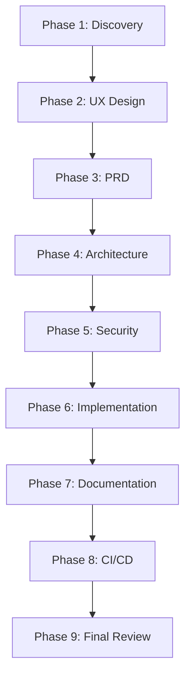

# Requirements to Development - Unified Workflow

**Mission**: Transform a raw idea into production-ready code by orchestrating specialized agents through a standardized software engineering lifecycle.

## Overview

This prompt creates a coordinated workflow that automatically:
1. ✅ Clarifies requirements with Product Management
2. 🎨 Designs user experience
3. 📋 Generates comprehensive PRD
4. 🏗️ Reviews architecture
5. 🔒 Validates security
6. 💻 Implements code with best practices
7. ✅ Creates tests and documentation
8. 🚀 Sets up CI/CD pipeline
9. 📝 Documents everything

## Input Requirements

You must provide:
- **Requirement Description**: What you want to build (e.g., "Add OAuth login")
- **Project Context** (optional but recommended):
  - Target users
  - Existing system context
  - Technical constraints
  - Timeline/urgency

## Workflow Phases

### Phase 1: Requirements Discovery & Refinement
**Goal**: Understand the "why" before the "how"

**Agent**: `SE: Product Manager`

**Actions**:
1. Interview stakeholders about:
   - Target users and their problems
   - Success metrics (measurable KPIs)
   - Business constraints
2. Create GitHub Epic/Issue with:
   - Clear problem statement
   - User stories
   - Acceptance criteria
   - Proper labels (`size: *`, component labels)

**Outputs**:
- GitHub Issue URL
- User stories documented
- Success criteria defined

**Transition**: Once requirements are clear, proceed to Phase 2

---

### Phase 2: User Experience Design
**Goal**: Map user journeys before writing code

**Agent**: `SE: UX Designer`

**Actions**:
1. Conduct Jobs-to-be-Done (JTBD) analysis
2. Create user journey map
3. Document interaction patterns
4. Identify accessibility requirements
5. Define mobile/responsive considerations

**Outputs**:
- User journey map (markdown)
- JTBD analysis
- Interaction patterns
- Accessibility checklist

**Transition**: UX research feeds into PRD

---

### Phase 3: Product Requirements Document
**Goal**: Create single source of truth for implementation

**Skill**: `prd`

**Actions**:
1. Generate comprehensive PRD including:
   - Executive summary
   - User experience requirements
   - Technical specifications
   - Success metrics
   - Risk analysis
   - Non-goals (scope protection)
2. Link to Phase 1 GitHub issue
3. Reference Phase 2 UX research

**Outputs**:
- PRD document (markdown in `doc/requirements/`)
- Technical specifications
- API contracts
- Data models

**Transition**: PRD becomes blueprint for architecture

---

### Phase 4: Architecture Review
**Goal**: Design system that scales, performs, and doesn't fail at 3AM

**Agent**: `SE: Architect`

**Actions**:
1. Analyze system context (web app, AI system, data pipeline?)
2. Apply relevant Well-Architected frameworks
3. Review:
   - Scalability patterns
   - Data flow and storage
   - Service boundaries
   - Integration patterns
   - AI/ML specific concerns (if applicable)
4. Document architectural decisions (ADR)
5. Create architecture diagrams

**Outputs**:
- Architecture Decision Record (ADR)
- System diagrams
- Component specifications
- API design validation

**Quality Gates**:
- [ ] Handles expected scale
- [ ] Performance requirements met
- [ ] Failure recovery planned
- [ ] Cost optimized

**Transition**: Architecture validates feasibility, security review next

---

### Phase 5: Security Review
**Goal**: Prevent security vulnerabilities before code is written

**Agent**: `SE: Security`

**Actions**:
1. Create targeted review plan based on:
   - Code type (web API, AI/LLM, ML model)
   - Risk level (high: auth/payment, medium: user data, low: UI)
2. Review against:
   - OWASP Top 10
   - OWASP LLM Top 10 (for AI features)
   - Zero Trust principles
3. Document security requirements:
   - Authentication/authorization
   - Data protection
   - Input validation
   - Secret management
   - API security

**Outputs**:
- Security requirements checklist
- Threat model
- Security test cases
- Compliance requirements

**Quality Gates**:
- [ ] OWASP Top 10 addressed
- [ ] Access control defined
- [ ] Data protection planned
- [ ] Secret management designed

**Transition**: Security requirements feed into implementation

---

### Phase 6: Implementation
**Goal**: Write clean, maintainable, tested code

**Actions**:
1. Break down into development tasks (use GitHub sub-issues)
2. Follow language-specific instructions:
   - Go: `.github/instructions/go.instructions.md`
   - Frontend: Follow project conventions
3. Apply design patterns from `systemPatterns.md`
4. Implement with:
   - Unit tests (aim for 80%+ coverage)
   - Integration tests for APIs
   - Error handling
   - Logging and observability

**Tools**:
- `edit/editFiles` for implementation
- `refactor` skill for code improvements
- Language-specific linters

**Outputs**:
- Production code
- Test suite
- Code documentation

**Quality Gates**:
- [ ] Tests pass
- [ ] No linter errors
- [ ] Code reviewed (self-review minimum)
- [ ] Documentation updated

---

### Phase 7: Documentation
**Goal**: Make it easy for others to understand and use

**Agent**: `SE: Tech Writer`

**Actions**:
1. Create/update documentation:
   - **API docs**: Endpoints, parameters, examples
   - **User guides**: How-to for end users
   - **Developer docs**: Architecture, setup, contribution
   - **README updates**: If new features
2. Ensure documentation is:
   - Clear and concise
   - Includes examples
   - Covers edge cases
   - Accessible to target audience

**Outputs**:
- API documentation
- User guides
- README updates
- Wiki/knowledge base entries

**Transition**: Documentation enables DevOps automation

---

### Phase 8: CI/CD & Deployment
**Goal**: Make deployments boring and reliable

**Agent**: `SE: DevOps/CI`

**Actions**:
1. Set up/update CI pipeline:
   - Build automation
   - Test automation (unit, integration, e2e)
   - Security scanning
   - Linting and formatting
2. Configure deployment:
   - Staging environment
   - Production deployment strategy
   - Rollback procedures
   - Monitoring and alerts
3. Document runbooks:
   - Deployment steps
   - Troubleshooting guides
   - Incident response

**Outputs**:
- CI/CD pipeline configuration
- Deployment scripts
- Monitoring setup
- Runbook documentation

**Quality Gates**:
- [ ] Automated tests in CI
- [ ] Deployment tested in staging
- [ ] Rollback tested
- [ ] Monitoring configured

---

### Phase 9: Final Review & Launch
**Goal**: Ensure everything is production-ready

**Actions**:
1. **Final Security Scan**: Run automated security tools
2. **Performance Testing**: Load test if applicable
3. **Documentation Review**: All docs complete?
4. **Stakeholder Review**: Demo to product owner
5. **Launch Checklist**:
   - [ ] All tests passing
   - [ ] Security review complete
   - [ ] Documentation complete
   - [ ] Monitoring active
   - [ ] Rollback plan ready
   - [ ] Team trained (if needed)

**Outputs**:
- Launch readiness report
- Post-launch monitoring plan
- Success metrics dashboard

---

## Automation & Orchestration

### Automatic Phase Progression

The workflow automatically progresses through phases when quality gates are met. You can:

1. **Run Full Workflow**: 
   ```
   /req-dev "Add user authentication with OAuth"
   ```
   This runs ALL phases from requirements to deployment.

2. **Skip to Specific Phase**:
   ```
   /req-dev --phase=implementation "Implement OAuth login"
   ```
   Available phases: `discovery`, `ux`, `prd`, `architecture`, `security`, `implementation`, `documentation`, `devops`, `review`

3. **Resume from Checkpoint**:
   ```
   /req-dev --resume "Continue OAuth feature"
   ```
   Resumes from last completed phase.

### Phase Dependencies



### Integration with Existing Tools

**GitHub Integration**:
- Creates Epic for full feature
- Creates sub-issues for each phase
- Links all artifacts to issues
- Updates issue status automatically

**Memory Bank Integration**:
- Updates `activeContext.md` with current phase
- Logs decisions in `progress.md`
- Updates `systemPatterns.md` with new patterns
- Creates task files in `tasks/` folder

**Documentation Integration**:
- Stores PRD in `doc/requirements/`
- Creates ADRs in `doc/architecture/`
- Updates wiki with new features
- Links all docs to GitHub issues

---

## Usage Examples

### Example 1: Simple Feature
```
User: /req-dev "Add export to CSV functionality for reports"

Agent:
Phase 1 - Discovery:
- Creating GitHub issue...
- Asking clarifying questions...
- Who needs to export? (analysts, managers?)
- How big are the reports? (100 rows, 100k rows?)
- Any specific CSV format requirements?

[Proceeds through all 9 phases automatically]
```

### Example 2: Complex System
```
User: /req-dev "Build AI-powered interview feedback system"

Agent:
Phase 1 - Discovery:
- This is an AI system, creating Epic...
- Breaking into sub-features...

Phase 2 - UX Design:
- Interviewer journey map...
- Candidate feedback experience...

Phase 3 - PRD:
- AI model requirements...
- Evaluation criteria...
- Privacy requirements...

Phase 4 - Architecture:
- Applying AI Well-Architected framework...
- Model serving strategy...
- Data pipeline design...

Phase 5 - Security:
- OWASP LLM Top 10 review...
- Prompt injection prevention...
- PII handling...

[Continues through implementation, docs, CI/CD]
```

### Example 3: Skip to Implementation
```
User: /req-dev --phase=implementation "The PRD and architecture are done, just implement the OAuth login"

Agent:
Skipping to Phase 6 - Implementation
- Reading PRD from doc/requirements/oauth-login.md...
- Reading architecture from doc/architecture/adr-oauth.md...
- Breaking into tasks...
- Implementing OAuth provider integration...
[Proceeds with implementation, testing, docs, CI/CD]
```

---

## Quality Standards

### Definition of Done (Every Phase)

- [ ] **Documented**: All artifacts created and linked
- [ ] **Reviewed**: Self-review or peer review completed
- [ ] **Tested**: Relevant tests pass (if applicable)
- [ ] **Integrated**: Linked to GitHub issue and Memory Bank
- [ ] **Quality Gates Met**: Phase-specific criteria satisfied

### Overall Feature Definition of Done

- [ ] All 9 phases completed
- [ ] All quality gates passed
- [ ] GitHub issue marked "Done"
- [ ] Memory Bank updated
- [ ] Stakeholders notified
- [ ] Monitoring active
- [ ] Team trained (if needed)

---

## Customization

### Adjust for Project Needs

**Skip phases** for simple changes:
```
/req-dev --skip=ux,architecture "Fix typo in README"
```

**Add custom phases**:
```
/req-dev --custom-phase="Legal Review" "Add GDPR compliance"
```

**Change quality gates**:
Modify quality gates in this prompt file to match your standards.

---

## Troubleshooting

### Phase Stuck?
If a phase is blocked:
1. Check quality gates - which one is failing?
2. Resolve blockers (e.g., missing information)
3. Use `--skip-gate=<gate-name>` to bypass (use cautiously)

### Agent Not Available?
If a required agent is unavailable:
1. The workflow will notify you
2. You can manually complete the phase
3. Use `--manual-phase=<phase>` to mark as complete

### Need Human Review?
Use `--pause-after=<phase>` to pause for human review:
```
/req-dev --pause-after=architecture "Review architecture before coding"
```

---

## Best Practices

1. **Start with Discovery**: Never skip Phase 1 unless requirements are crystal clear
2. **Document Decisions**: Every architectural decision should create an ADR
3. **Security Early**: Don't leave security review until after coding
4. **Test Continuously**: Write tests during implementation, not after
5. **Update Memory Bank**: Keep `activeContext.md` and `progress.md` current
6. **Link Everything**: GitHub issue → PRD → ADR → Code → Tests → Docs
7. **Automate When Possible**: CI/CD should catch issues before humans review

---

## Metrics & Success Criteria

Track these metrics to improve the workflow:

- **Time per phase**: Identify bottlenecks
- **Quality gate failures**: Which phases need improvement?
- **Rework rate**: How often do we revisit completed phases?
- **Issue-to-deploy time**: Overall cycle time
- **Post-launch incidents**: Did we miss something in review?

---

## Memory Bank Integration

This workflow automatically updates:

- **`activeContext.md`**: Current phase and decisions
- **`progress.md`**: Completed phases and blockers
- **`tasks/_index.md`**: Task status and updates
- **`systemPatterns.md`**: New patterns discovered
- **`techContext.md`**: New technologies or dependencies

---

## Support & Documentation

- **Full workflow documentation**: `doc/workflows/req-dev-process.md` (auto-generated)
- **Agent documentation**: `.github/agents/`
- **Skill documentation**: `.github/skills/`
- **GitHub Issue Templates**: `.github/ISSUE_TEMPLATE/`

---

## Example Session

```
User: /req-dev "Add user profile picture upload"

Agent:
🎯 Starting Requirements-to-Development Workflow
━━━━━━━━━━━━━━━━━━━━━━━━━━━━━━━━━━━━━━━━

📋 PHASE 1: Requirements Discovery
━━━━━━━━━━━━━━━━━━━━━━━━━━━━━━━━━━━━━━━━
Agent: SE: Product Manager

Let me clarify the requirements:

1. **Who will upload profile pictures?**
   - All users or specific roles?
   
2. **What file formats should we support?**
   - JPG, PNG? What about WebP, GIF, HEIC?
   
3. **Any size limits?**
   - Storage costs matter. Max file size?
   
4. **Where will images be stored?**
   - Local storage, S3, CDN?
   
5. **What about moderation?**
   - Auto-moderation for inappropriate content?

[User provides answers]

✅ GitHub Epic created: #456
   - Title: [Feature] User Profile Picture Upload
   - Labels: enhancement, size: medium, frontend, backend
   - Linked sub-issues:
     - #457: Frontend upload UI
     - #458: Backend storage API
     - #459: Image processing pipeline

━━━━━━━━━━━━━━━━━━━━━━━━━━━━━━━━━━━━━━━━

🎨 PHASE 2: User Experience Design
━━━━━━━━━━━━━━━━━━━━━━━━━━━━━━━━━━━━━━━━
Agent: SE: UX Designer

Jobs-to-be-Done Analysis:
- User wants to personalize their profile
- Needs to see preview before uploading
- Expects drag-and-drop functionality
- Mobile upload from camera roll

User Journey Map created: doc/ux/profile-picture-journey.md

Key interactions:
1. Click profile picture area → Upload dialog
2. Drag & drop or select file → Preview modal
3. Crop/rotate tool → Adjust image
4. Confirm → Progress indicator → Success state

Accessibility checklist:
- [ ] Keyboard navigation
- [ ] Screen reader support
- [ ] Error messages clear
- [ ] Alt text required

━━━━━━━━━━━━━━━━━━━━━━━━━━━━━━━━━━━━━━━━

📄 PHASE 3: Product Requirements Document
━━━━━━━━━━━━━━━━━━━━━━━━━━━━━━━━━━━━━━━━
Skill: prd

Generating comprehensive PRD...

✅ PRD created: doc/requirements/profile-picture-upload.md

Highlights:
- **Success Metrics**:
  - 70% of users upload profile picture within 7 days
  - <5% upload failures
  - 95th percentile upload time <3 seconds
  
- **Technical Requirements**:
  - Max file size: 5MB
  - Supported formats: JPG, PNG, WebP
  - Auto-resize to 512x512px
  - Generate thumbnails: 128x128, 64x64, 32x32
  
- **Security Requirements**:
  - Content-Type validation
  - EXIF data stripping
  - Antivirus scanning (large files)
  - Rate limiting: 5 uploads/hour

━━━━━━━━━━━━━━━━━━━━━━━━━━━━━━━━━━━━━━━━

🏗️ PHASE 4: Architecture Review
━━━━━━━━━━━━━━━━━━━━━━━━━━━━━━━━━━━━━━━━
Agent: SE: Architect

System analysis: Web app with moderate scale

Architecture decisions:

1. **Storage**: S3-compatible object storage
   - Scalable, cost-effective
   - CDN integration for global delivery
   
2. **Upload flow**:
   - Frontend: Pre-signed URL upload (direct to S3)
   - Backend: Generate URL, validate, process
   - Async: Image processing pipeline (resize, thumbnails)
   
3. **Components**:
   - Upload service (API)
   - Processing worker (queue-based)
   - CDN for serving images

✅ ADR created: doc/architecture/adr-profile-picture-storage.md

Quality gates:
- [x] Handles 100K users uploading
- [x] <3s upload time (99th percentile)
- [x] $50/month storage cost estimated
- [x] Failure recovery: retry logic, DLQ

━━━━━━━━━━━━━━━━━━━━━━━━━━━━━━━━━━━━━━━━

🔒 PHASE 5: Security Review
━━━━━━━━━━━━━━━━━━━━━━━━━━━━━━━━━━━━━━━━
Agent: SE: Security

Risk level: Medium (user data, file uploads)

Security checks:

✅ OWASP A01 - Access Control
   - Pre-signed URLs expire in 15 minutes
   - Users can only upload to their own profile
   
✅ OWASP A03 - Injection
   - File content validated (not just extension)
   - EXIF data stripped
   
✅ OWASP A04 - Insecure Design
   - Rate limiting prevents abuse
   - Virus scanning for large files
   
✅ OWASP A05 - Security Misconfiguration
   - S3 bucket not public
   - CORS restricted to app domain

Security test cases created: tests/security/profile-picture-security.test.ts

Quality gates:
- [x] OWASP Top 10 addressed
- [x] File upload vulnerabilities prevented
- [x] Rate limiting implemented
- [x] Content validation enforced

━━━━━━━━━━━━━━━━━━━━━━━━━━━━━━━━━━━━━━━━

💻 PHASE 6: Implementation
━━━━━━━━━━━━━━━━━━━━━━━━━━━━━━━━━━━━━━━━

Breaking into tasks:
- Task 1: Frontend upload UI component
- Task 2: Backend pre-signed URL API
- Task 3: Image processing worker
- Task 4: CDN integration
- Task 5: Error handling & retry logic

Implementing...

[Shows progress for each task]

✅ Implementation complete:
- frontend/src/components/ProfilePictureUpload.tsx
- backend/api/handler/upload/profile_picture.go
- backend/workers/image_processor.go
- tests/ (unit + integration tests)

Test results:
- Unit tests: 47/47 passed
- Integration tests: 12/12 passed
- Coverage: 87%

Quality gates:
- [x] All tests passing
- [x] No linter errors
- [x] Error handling complete
- [x] Logging added

━━━━━━━━━━━━━━━━━━━━━━━━━━━━━━━━━━━━━━━━

📝 PHASE 7: Documentation
━━━━━━━━━━━━━━━━━━━━━━━━━━━━━━━━━━━━━━━━
Agent: SE: Tech Writer

Creating documentation...

✅ Documentation created:
- API docs: doc/api/upload-profile-picture.md
- User guide: doc/user-guide/profile-settings.md
- Developer docs: doc/dev/image-upload-architecture.md
- README updated: Added profile picture feature

Quality gates:
- [x] API documented with examples
- [x] User guide clear for non-technical users
- [x] Developer setup instructions complete
- [x] Troubleshooting section added

━━━━━━━━━━━━━━━━━━━━━━━━━━━━━━━━━━━━━━━━

🚀 PHASE 8: CI/CD & Deployment
━━━━━━━━━━━━━━━━━━━━━━━━━━━━━━━━━━━━━━━━
Agent: SE: DevOps/CI

CI/CD setup:

✅ CI Pipeline (.github/workflows/profile-picture.yml):
- Build: ✓
- Unit tests: ✓
- Integration tests: ✓
- Security scan: ✓
- Linting: ✓

✅ Deployment:
- Staging: Deployed & tested
- Production: Ready for rollout
- Rollback plan: Documented

✅ Monitoring:
- Upload success rate dashboard
- Error rate alerts
- Storage usage tracking

Runbook created: doc/runbooks/profile-picture-troubleshooting.md

Quality gates:
- [x] CI tests pass
- [x] Staging deployment successful
- [x] Rollback tested
- [x] Monitoring configured

━━━━━━━━━━━━━━━━━━━━━━━━━━━━━━━━━━━━━━━━

✅ PHASE 9: Final Review & Launch
━━━━━━━━━━━━━━━━━━━━━━━━━━━━━━━━━━━━━━━━

Launch checklist:
- [x] All tests passing
- [x] Security review complete
- [x] Documentation complete
- [x] Monitoring active
- [x] Rollback plan ready
- [x] Stakeholders notified

🎉 Feature ready for production deployment!

Summary:
━━━━━━━━━━━━━━━━━━━━━━━━━━━━━━━━━━━━━━━━
- GitHub Epic: #456 (Ready for deployment)
- PRD: doc/requirements/profile-picture-upload.md
- Architecture: doc/architecture/adr-profile-picture-storage.md
- Code: 8 files changed, 1,247 insertions
- Tests: 59 tests, 87% coverage
- Documentation: 4 docs created
- CI/CD: Pipeline configured
- Estimated deploy time: 15 minutes

Would you like to proceed with deployment?
```

---

## Advanced Features

### Parallel Development

For large features, phases can run in parallel:
```
/req-dev --parallel "Add OAuth login"
```
- UX design + Architecture review (Phase 2 + 4)
- Implementation + Documentation (Phase 6 + 7)

### Feature Flags

Integrate with feature flag systems:
```
/req-dev --feature-flag="profile_picture_upload" "Add profile pictures"
```
- Deploys code behind feature flag
- Enables gradual rollout
- Easy rollback without deployment

### A/B Testing

Set up A/B testing from the start:
```
/req-dev --ab-test "Test two upload UI variants"
```
- Splits Phase 2 (UX) into variants
- Implements both variants
- Sets up analytics tracking

---

## Version History

- **v1.0.0** (2026-01-30): Initial unified workflow
- Future: Add AI code review, automated refactoring, performance testing phases

---

**Ready to transform requirements into production code?**

Type `/req-dev "<your requirement>"` to start the workflow.
