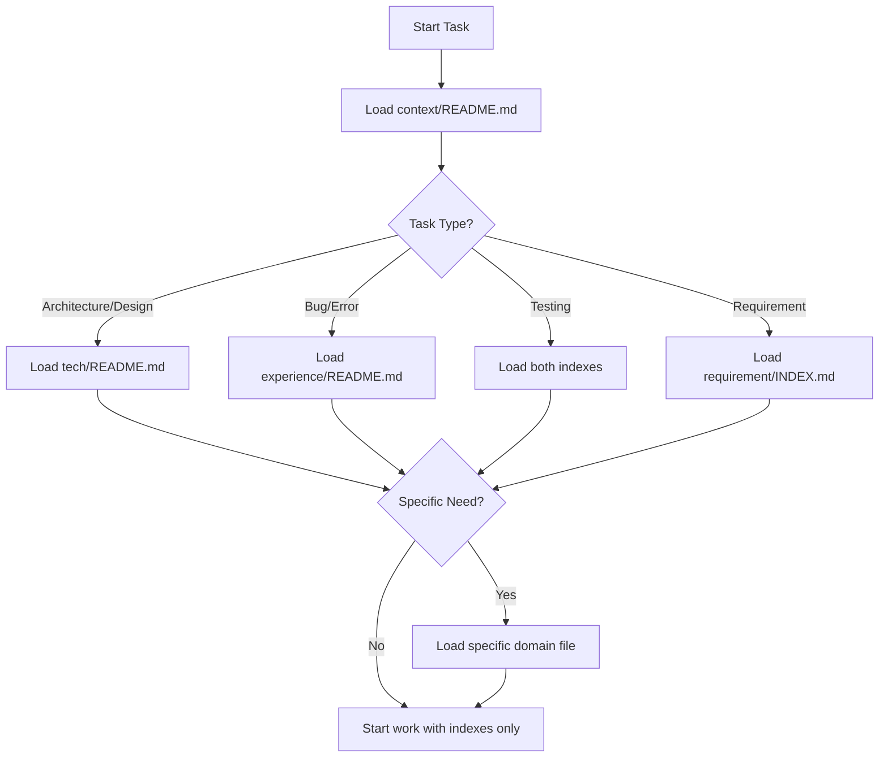

# Context Loader - Intelligent Index-First Context Loading

## Overview

A systematic approach to load project knowledge efficiently without polluting the context window. This skill implements the "index-first" strategy from Anthropic's effective context engineering principles - always start with lightweight indexes, then selectively load only what's needed for the current task.

## Core Problem

**Context Pollution**: Loading entire knowledge directories wastes tokens and reduces effectiveness. The typical anti-pattern:

```
❌ BAD: Load all files "just in case"
Start → Load all context files (20,000 tokens) → Context window 50% full → Work constrained

✅ GOOD: Index-first, selective loading
Start → Load indexes (500 tokens) → Identify needs → Load specific files (3,000 tokens) → Work freely
```

## When to Use This Skill

Activate this skill when:
- ✅ Starting any work phase (Plan/Work/Review/Compound)
- ✅ User asks "what do we know about X"
- ✅ User says "check the knowledge base"
- ✅ User mentions "review existing patterns"
- ✅ User asks "have we seen this before"
- ✅ Need to understand prior architectural decisions
- ✅ Looking for error patterns or solutions
- ✅ Before making similar changes to existing code

**Phases where this is critical:**
- **Plan**: Load architecture decisions and design patterns
- **Work**: Load relevant error patterns and test strategies
- **Review**: Load coding standards and quality patterns
- **Compound**: Load all relevant knowledge for synthesis

## Prerequisites

- Project has context/ directory with knowledge base
- Index files exist: `context/README.md`, `context/tech/README.md`, `context/experience/README.md`
- (Optional) Requirements index: `requirement/INDEX.md`

## The Index-First Strategy

### Three-Level Loading

```
Level 1: Primary Index (Always load first)
├── context/README.md (~500 tokens)
└── requirement/INDEX.md (~300 tokens)

Level 2: Domain Indexes (Load based on task type)
├── context/tech/README.md (for technical queries)
└── context/experience/README.md (for problem-solving)

Level 3: Specific Domain Files (Load only what's needed)
├── context/tech/{specific-domain}.md
└── context/experience/{specific-domain}.md
```

### Loading Decision Tree



## Workflow

### Step 1: Identify Task Context Needs

**Questions to ask:**
- What is the user trying to accomplish?
- Is this technical (architecture, testing, build) or experiential (errors, debugging, workflows)?
- Does this relate to a specific requirement?
- Is this similar to something we've done before?

**Task Type → Context Mapping:**

| Task Type | Primary Load | Secondary Load (if needed) |
|-----------|--------------|---------------------------|
| Architecture design | `context/README.md`<br>`context/tech/README.md` | `tech/architecture.md` |
| Fixing build error | `context/README.md`<br>`context/experience/README.md` | `experience/error-patterns.md` |
| Writing tests | `context/README.md`<br>`context/tech/README.md` | `tech/testing-strategy.md`<br>`experience/test-patterns.md` |
| Code review | `context/README.md`<br>`context/experience/README.md` | `experience/workflow-improvements.md` |
| Planning feature | `context/README.md`<br>`requirement/INDEX.md` | `tech/architecture.md`<br>specific requirement file |
| Debugging issue | `context/README.md`<br>`context/experience/README.md` | `experience/debugging-tactics.md`<br>`experience/error-patterns.md` |

### Step 2: Load Primary Indexes

**Always start here:**

```bash
# Read these first in ONE batch
read_file context/README.md (lines 1-100)
read_file requirement/INDEX.md (lines 1-50)
```

**What to extract:**
- ✅ Available domain categories
- ✅ Recent updates and patterns
- ✅ Knowledge base structure
- ✅ Quick references
- ❌ Don't load full domain files yet!

### Step 3: Analyze Task Against Indexes

**From the indexes, determine:**
1. Which domain(s) are relevant?
2. Are there specific patterns mentioned that match the task?
3. Is this a known issue with documented solution?
4. Are there related requirements to link?

**Example Analysis:**

```markdown
User task: "Fix test timeout error in integration tests"

Index analysis:
- Type: Error pattern (experience domain)
- Domain: Testing (tech domain)
- Potential files:
  ✅ experience/error-patterns.md (if timeout is documented)
  ✅ tech/testing-strategy.md (testing configuration)
  ❌ tech/architecture.md (not relevant)
  ❌ tech/build-system.md (not relevant)
```

### Step 4: Selective Domain Loading

**Load only identified domain files:**

```bash
# Based on analysis, load ONLY these
read_file context/experience/README.md (domain index)
read_file context/experience/error-patterns.md (specific domain)
```

**Search before full load (optimization):**

```bash
# Use grep to check if pattern exists before loading entire file
grep_search "timeout" in context/experience/error-patterns.md
```

**If grep finds relevant content → load the file**
**If grep finds nothing → skip the file**

### Step 5: Load Linked Resources (if referenced)

**Only if domain files reference other resources:**

```markdown
From error-patterns.md:
"See testing-strategy.md for timeout configuration"

→ Now load: context/tech/testing-strategy.md
```

**Follow references chain, but stop at 2 levels deep.**

### Step 6: Summarize Loaded Context

**Before proceeding with task, provide user summary:**

```markdown
📚 Context Loaded:

**Indexes reviewed:**
- context/README.md - Knowledge base structure
- requirement/INDEX.md - Active requirements

**Domain knowledge:**
- experience/error-patterns.md - Found 3 timeout-related patterns
- tech/testing-strategy.md - Integration test configuration

**Key findings:**
- Pattern found: Jest integration test timeouts
- Solution documented: Global timeout configuration
- Related requirement: REQ-042 (test stability)

**Context efficiency:**
- Files loaded: 4
- Estimated tokens: ~2,500
- Alternative (load all): 15 files, ~18,000 tokens
- Savings: 86% reduction ✅
```

## Examples

### Example 1: Planning New Feature

**User Request**: "Plan authentication feature"

**Loading Sequence:**
```
1. Load context/README.md
   → See: architecture section exists
   
2. Load context/tech/README.md
   → See: architecture.md has auth patterns
   
3. Load context/tech/architecture.md
   → Found: ADR-003 on authentication strategy
   
4. Load requirement/INDEX.md
   → Check: No existing auth requirements
   
STOP - Have sufficient context (3 files, ~2,000 tokens)
```

### Example 2: Fixing Build Error

**User Request**: "Build failing with MODULE_NOT_FOUND"

**Loading Sequence:**
```
1. Load context/README.md
   → See: experience/error-patterns.md
   
2. Grep search "MODULE_NOT_FOUND" in experience/error-patterns.md
   → Found match!
   
3. Load context/experience/error-patterns.md
   → Found: Documented solution for this error
   
STOP - Problem solved (2 files, ~1,200 tokens)
```

### Example 3: Code Review

**User Request**: "Review this pull request"

**Loading Sequence:**
```
1. Load context/README.md
   → See: multiple relevant domains
   
2. Load context/experience/README.md
   → See: workflow-improvements.md has review checklist
   
3. Load context/experience/workflow-improvements.md
   → Found: Code review best practices
   
4. Load context/tech/architecture.md (if architectural changes)
   → Verify against design principles
   
STOP - Have review context (3-4 files, ~2,500 tokens)
```

### Example 4: Complete Context Load (Synthesis)

**User Request**: "/learn" (knowledge synthesis mode)

**Loading Sequence:**
```
1. Load context/README.md (required)
2. Load requirement/INDEX.md (required)
3. Based on learning type:
   - Technical: Load tech/README.md + specific domain
   - Experience: Load experience/README.md + specific domain
4. Load related requirement files (if applicable)

STOP - Sufficient for synthesis (4-6 files, ~4,000 tokens)
```

## Anti-Patterns to Avoid

### ❌ Loading Everything

```bash
# DON'T DO THIS
read_file context/tech/*.md  # Loads all tech files
read_file context/experience/*.md  # Loads all experience files
```

**Why it's bad:**
- Wastes 15,000+ tokens
- Context window fills up
- Reduces model effectiveness
- Slows down processing

### ❌ Skipping Indexes

```bash
# DON'T DO THIS
read_file context/tech/architecture.md  # Directly to domain file
```

**Why it's bad:**
- Miss overview of what's available
- Might load wrong domain
- Can't see cross-references
- No understanding of knowledge structure

### ❌ Loading Without Analysis

```bash
# DON'T DO THIS
read_file context/tech/testing-strategy.md
read_file context/tech/build-system.md
read_file context/tech/frameworks.md
# Just loading everything that sounds relevant...
```

**Why it's bad:**
- Not based on actual task needs
- "Just in case" loading
- No systematic approach
- Accumulates waste

## Best Practices

### ✅ Use Grep Before Load

```bash
# Search first
grep_search "authentication" in context/tech/architecture.md

# Only load if relevant content found
if found:
    read_file context/tech/architecture.md
```

### ✅ Load in Batches

```bash
# Batch read indexes (parallel loading)
[
    read_file context/README.md,
    read_file requirement/INDEX.md
]
```

### ✅ Progressive Loading

```
Iteration 1: Indexes only → Analyze
Iteration 2: Add 1-2 domain files → Re-analyze
Iteration 3: Add linked files (if needed)
STOP when sufficient context gathered
```

### ✅ Document What You Loaded

Always tell the user what context you loaded and why, so they understand your decision-making process.

## Integration with Other Workflows

### With /plan (Planning Stage)

```markdown
/plan → context-loader → Load architecture + requirement index → Start planning
```

### With /work (Development Stage)

```markdown
/work → context-loader → Load error patterns + testing strategy → Start coding
```

### With /review (Review Stage)

```markdown
/review → context-loader → Load workflow improvements + architecture → Review code
```

### With /learn (Learning Stage)

```markdown
/learn → context-loader → Load relevant domain → Add new knowledge
```

## Troubleshooting

| Issue | Cause | Solution |
|-------|-------|----------|
| Loaded too much | Skipped analysis step | Go back to Step 3, analyze task needs |
| Can't find relevant info | Only loaded indexes | Proceed to Step 4, load specific domains |
| Still unclear | Domain file missing content | Document this as gap, add to /learn |
| Duplicate loading | Didn't track loaded files | Maintain loaded file list during session |
| Context window full | Loaded without strategy | Start over with fresh context, use this skill |

## Related Resources

- [Effective Context Engineering](https://www.anthropic.com/engineering/effective-context-engineering-for-ai-agents) - Anthropic's principles
- [learn.prompt.md](../../prompts/learn.prompt.md) - Knowledge synthesis workflow
- [memory-bank.instructions.md](../../instructions/memory-bank.instructions.md) - Memory management

## Success Metrics

**Good context loading:**
- ✅ < 5 files loaded for typical tasks
- ✅ < 5,000 tokens for typical tasks
- ✅ Found relevant information efficiently
- ✅ User understands what context was used

**Poor context loading:**
- ❌ > 10 files loaded
- ❌ > 15,000 tokens consumed
- ❌ Still missing key information
- ❌ Unclear what was loaded or why

---

**Version**: 1.0  
**Created**: 2026-01-30  
**Maintained By**: Copilot Code Repository
