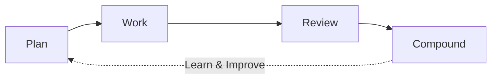

# copilot-generate-code

> A comprehensive collection of AI-powered agents, skills, and workflows that transform GitHub Copilot into a professional software engineering assistant.

Build better software faster with structured workflows, intelligent context management, and battle-tested patterns that scale from solo projects to enterprise teams.

## Why This Matters

Traditional AI coding assistants are reactive tools. **This project makes them proactive engineering partners** by providing:

- **Structured Workflows**: Follow industry-standard practices (Plan → Work → Review → Compound)
- **Intelligent Context**: Load only relevant knowledge, reduce token usage by 80-85%
- **Quality Built-In**: TDD, security reviews, and architectural validation at every step
- **Knowledge Compounding**: Learn from every project, never solve the same problem twice

## Quick Start

### 1. Copy to Your Project

```bash
# Copy the toolkit structure
cp -r .github/ context/ requirement/ /path/to/your/project/
```

### 2. Start Using Workflows

```bash
# Plan a feature with structured requirements
/plan "Add user authentication"

# Develop with TDD
/tdd "Create login function"

# Review code systematically
/review

# Learn from experience
/learn "Pattern discovered: JWT token refresh strategy"
```

### 3. Leverage Professional Agents

Specialized experts for every engineering discipline:
- `@se-architect` - System architecture and design
- `@se-product-manager` - Requirements and business alignment
- `@se-security-reviewer` - Security and compliance
- `@tdd-red` → `@tdd-green` → `@tdd-refactor` - Test-driven development

## What's Inside

### Core Workflows (Prompts)

Professional workflows that guide you through each development stage:

| Workflow | Command | Purpose | Stage |
|----------|---------|---------|-------|
| **Plan** | `/plan` | Requirements, architecture, UX research | Plan |
| **TDD** | `/tdd` | Test-driven development cycle | Work |
| **E2E** | `/e2e` | End-to-end testing | Work |
| **Build Fix** | `/build-fix` | Systematic build error resolution | Work |
| **Code Review** | `/review` | Security, quality, architecture review | Review |
| **Learn** | `/learn` | Knowledge capture and synthesis | Compound |

### Professional Agents (11)

Specialized AI experts with deep domain knowledge:

<details>
<summary><strong>Planning & Design (4 agents)</strong></summary>

- **SE: Product Manager** - GitHub issue creation, business value alignment
- **SE: UX Designer** - Jobs-to-be-Done analysis, user journey mapping
- **SE: Architect** - System architecture, Well-Architected frameworks
- **Context7** - Latest library versions and best practices

</details>

<details>
<summary><strong>Development (4 agents)</strong></summary>

- **TDD Red** - Write failing tests that define behavior
- **TDD Green** - Minimal implementation to pass tests
- **TDD Refactor** - Improve quality while maintaining tests
- **SE: Tech Writer** - Developer documentation and tutorials

</details>

<details>
<summary><strong>Operations & Review (3 agents)</strong></summary>

- **SE: Security Reviewer** - OWASP, LLM security, zero-trust
- **SE: Responsible AI** - Bias detection, accessibility, ethics
- **SE: DevOps/CI** - CI/CD pipelines, deployment debugging

</details>

### Reusable Skills (9)

Composable capabilities that extend functionality:

| Skill | Purpose | Key Feature |
|-------|---------|-------------|
| **context-loader** ⭐ | Intelligent context loading | 80-85% token reduction |
| **github-issues** | Issue management via MCP | Create, update, track issues |
| **git-commit** | Conventional commits | Auto-generated commit messages |
| **prd** | Product requirements | Professional PRD generation |
| **refactor** | Code improvement | Surgical refactoring patterns |
| **web-design-reviewer** | Visual inspection | Design issue detection |
| **agentic-eval** | Self-evaluation | Quality assessment |
| **skill-creator** | Create new skills | Skill scaffolding |
| **make-skill-template** | Skill templates | Quick skill creation |

> ⭐ **context-loader** is the foundation skill used by all workflows to prevent context pollution and optimize token usage.

### Knowledge Management System

Structured knowledge that grows with your project:

```
context/
├── tech/              # Technical decisions, testing, architecture
└── experience/        # Error patterns, debugging, workflows

requirement/
├── in-progress/       # Active requirements
└── completed/         # Finalized requirements
```

**Key Features:**
- Index-first loading strategy
- Domain separation (technical vs experiential)
- Incremental updates (no document pollution)
- Cross-referenced knowledge graph

## How It Works

### The Four-Stage Engineering Workflow



**1. Plan Stage**
- Gather requirements with product manager thinking
- Design UX with Jobs-to-be-Done framework
- Review architecture with Well-Architected principles
- Define test cases before code

**2. Work Stage**
- TDD cycle: Red → Green → Refactor
- E2E testing for user journeys
- Systematic build error resolution
- Context-aware development

**3. Review Stage**
- Security scanning (OWASP, LLM risks)
- Responsible AI checks (bias, accessibility)
- Architecture validation
- Code quality assessment

**4. Compound Stage**
- Capture learnings automatically
- Build knowledge base
- Create reusable patterns
- Continuous improvement

### Context Engineering

Traditional approach wastes tokens on irrelevant information:

```
❌ Load everything: 15+ files, 18,000+ tokens → Context pollution
```

Our approach is surgical and efficient:

```
✅ Index-first: Load README → Select domains → 3-5 files, 2,500 tokens
```

**Benefits:**
- 80-85% token reduction
- Higher response quality
- Faster processing
- Relevant context only

## Real-World Impact

### Token Efficiency

| Scenario | Traditional | With context-loader | Savings |
|----------|------------|---------------------|---------|
| Planning feature | 18,000 tokens | 2,800 tokens | 84% |
| Fixing bug | 15,000 tokens | 2,200 tokens | 85% |
| Code review | 20,000 tokens | 3,500 tokens | 82% |

### Quality Improvements

- **Test Coverage**: TDD workflow ensures tests before code
- **Security**: Automatic OWASP and LLM security reviews
- **Architecture**: Well-Architected framework validation
- **Knowledge Retention**: Never lose solutions to solved problems

### Team Productivity

- **Onboarding**: New members have full project context
- **Consistency**: Everyone follows the same structured approach
- **Learning**: Team knowledge compounds over time
- **Handoffs**: Complete documentation and requirement tracking

## Getting Started Guide

### For New Projects

1. **Bootstrap knowledge structure:**
   ```bash
   /learn
   # System auto-detects and creates context/ and requirement/ structure
   ```

2. **Plan your first feature:**
   ```bash
   /plan "User authentication with OAuth"
   # Creates structured requirement document
   ```

3. **Develop with TDD:**
   ```bash
   /tdd "Login endpoint"
   # Guides through Red-Green-Refactor cycle
   ```

### For Existing Projects

1. **Add toolkit to your project:**
   ```bash
   cp -r .github/ /path/to/your/project/
   ```

2. **Initialize knowledge base:**
   ```bash
   /learn
   # Choose [A] to bootstrap from existing codebase
   ```

3. **Start using workflows:**
   - Use `/review` for next pull request
   - Use `/build-fix` when builds fail
   - Use `/learn` to capture solutions

### For Teams

1. **Standardize workflows:**
   - Add to team repository template
   - Include in onboarding docs
   - Reference in PR templates

2. **Build team knowledge:**
   - Everyone uses `/learn` to share discoveries
   - Regular knowledge reviews
   - Cross-reference requirements

3. **Measure impact:**
   - Track token usage reduction
   - Monitor test coverage
   - Review security findings

## Advanced Features

### Architectural Decision Records (ADRs)

Built-in support for documenting why decisions were made:

```markdown
context/tech/architecture.md
├── ADR-001: Microservices vs Monolith
├── ADR-002: Authentication Strategy
└── ADR-003: Database Choice
```

### Requirement Traceability

Link code changes back to requirements:

```
requirement/in-progress/REQ-042-auth.md
├── Business justification
├── Acceptance criteria
├── Implementation learnings
└── GitHub issue linkage
```

### Multi-Language Support

Works with any programming language:
- JavaScript/TypeScript
- Python
- Go
- Java/Kotlin
- Rust
- And more...

## Best Practices

### Start Every Session

```bash
@context-loader  # Load only what you need
```

### Follow the Workflow

```bash
/plan → /tdd → /review → /learn
```

### Document Decisions

Use `/learn` immediately after solving important problems:

```bash
/learn "JWT refresh token pattern: Store refresh tokens in httpOnly cookies..."
```

### Review Regularly

Schedule time to review accumulated knowledge:
- Update outdated patterns
- Merge similar solutions
- Refine skill triggers

## Troubleshooting

<details>
<summary><strong>Context window filling up too quickly?</strong></summary>

Make sure you're using `@context-loader` skill. Check that you're not manually loading entire directories.

```bash
# Good
@context-loader

# Bad
read_file context/**/*.md
```

</details>

<details>
<summary><strong>Skills not activating?</strong></summary>

Check the skill's `description` field includes your trigger keywords. Skills activate based on user intent and keywords mentioned.

</details>

<details>
<summary><strong>Want to create custom skills?</strong></summary>

Use the built-in skill creator:

```bash
@skill-creator "Create a skill for API documentation generation"
```

Or duplicate `make-skill-template`:

```bash
@make-skill-template "my-custom-skill"
```

</details>

## Project Structure

```
.github/
├── agents/              # 11 specialized AI experts
├── skills/              # 9 reusable capabilities
├── prompts/             # 7+ workflow commands
└── instructions/        # Quality guidelines

context/                 # Project knowledge base
├── tech/                # Technical decisions
└── experience/          # Practical learnings

requirement/             # Requirement tracking
├── in-progress/         # Active work
└── completed/           # Delivered features

reference/               # Additional resources
```

## Contributing

This project uses its own workflows for development:

1. **Planning**: Use `/plan` to propose new features
2. **Development**: Use `/tdd` for implementation
3. **Review**: Use `/review` before PR
4. **Learning**: Use `/learn` to document patterns

See individual files for specific contribution guidelines.

## Philosophy

### Professional Software Engineering

This toolkit embodies battle-tested software engineering practices:
- Test-Driven Development (TDD)
- Domain-Driven Design (DDD)
- Well-Architected Framework
- Continuous Integration/Deployment
- Knowledge Management

### AI-Enhanced, Not AI-Replaced

We enhance human engineering with AI assistance:
- AI suggests, humans decide
- Structured workflows prevent AI drift
- Knowledge compounds over time
- Quality is built-in, not bolted-on

### Open and Extensible

Everything is customizable:
- Add your own agents
- Create custom skills
- Modify workflows
- Extend knowledge structure

## Inspiration

Built on insights from:
- [The Longform Guide to Everything Claude Code](https://github.com/affaan-m/everything-claude-code)
- [Anthropic's Context Engineering](https://www.anthropic.com/engineering/effective-context-engineering-for-ai-agents)
- Professional software engineering best practices
- Real-world project experience

## What's Next

Coming soon:
- Additional language-specific agents
- More specialized skills
- Team collaboration features
- Metrics and analytics

---

**Start building better software today.** Copy this toolkit to your project and experience the power of structured, AI-enhanced engineering.

*Questions? Feedback? Open an issue and let's improve together.*
