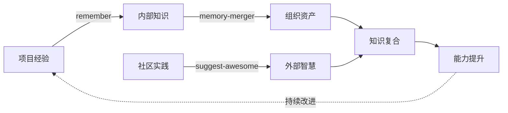

# 项目知识库

**项目**: {项目名称}  
**初始化**: {日期}  
**最后更新**: {日期}

## 概述

本知识库记录项目的技术架构、开发经验和最佳实践，帮助团队成员高效工作。这是一个动态知识库，随着项目进展持续更新。

> 💡 **使用提示**: 这是一个模板结构。请根据你的项目实际情况填充具体内容。使用 `/learn` 命令记录学习成果。

## 工作流阶段

| 阶段 | 说明 | 核心职责 |
|------|------|----------|
| 1️⃣ **Plan** | 规划 | 需求分析、架构设计、测试规划 |
| 2️⃣ **Work** | 工作 | 代码编写、功能实现、文档撰写 |
| 3️⃣ **Review** | 审查 | 代码审查、安全检查、质量优化 |
| 4️⃣ **Compound** | 复合 | 知识沉淀、经验总结、持续学习 |

## 知识库结构

### 技术知识 (`tech/`)
系统架构、测试策略、构建配置和框架特定知识。

- [技术知识索引](tech/README.md) - 技术领域概览
- [测试策略](tech/testing-strategy.md) - TDD/E2E 测试模式
- [构建系统](tech/build-system.md) - 构建配置和优化
- [架构设计](tech/architecture.md) - 系统设计决策
- [框架知识](tech/frameworks.md) - 框架特定知识

### 经验知识 (`experience/`)
常见错误、调试策略、工作流改进和实战经验。

- [经验知识索引](experience/README.md) - 经验领域概览
- [错误模式](experience/error-patterns.md) - 常见错误及解决方案
- [测试模式](experience/test-patterns.md) - 有效测试实践
- [调试策略](experience/debugging-tactics.md) - 调试技巧
- [工作流改进](experience/workflow-improvements.md) - 流程优化

## 快速开始

### 使用 Context Loader Skill

**推荐方式** - 在所有工作阶段开始时使用：

```bash
@context-loader
```

这个技能会自动：
- ✅ 加载轻量级索引文件（~500 tokens）
- ✅ 根据任务类型选择性加载相关领域
- ✅ 防止上下文污染，节省 80-85% tokens
- ✅ 确保加载的内容高度相关

**集成到工作流**：
- `/plan` - 自动加载架构决策和需求
- `/tdd` - 自动加载测试策略和模式
- `/e2e` - 自动加载 E2E 测试知识
- `/build-fix` - 自动加载构建系统和错误模式
- `/review` - 自动加载审查最佳实践
- `/learn` - 自动加载相关领域知识

详见 [context-loader skill](../.github/skills/context-loader/SKILL.md)

### 添加新知识

使用 `/learn` 命令记录学习成果：
```
/learn [你的发现/模式/解决方案]
```

### 查找知识
1. 查看本 README 了解知识结构
2. 导航到相关领域索引（tech/ 或 experience/）
3. 阅读具体领域文件
4. 使用搜索查找特定模式

## 核心原则

### 1. 索引优先加载
总是先加载轻量级索引文件，再按需加载具体文档。避免上下文污染。

### 2. 即时上下文策略
不预加载所有信息，而是维护索引，运行时动态加载相关知识。

### 3. 增量更新
仅更新必要部分，使用外科手术式编辑，保持文档整洁。

### 4. 分层组织
```
context/
├── tech/           # 技术层（方案设计时加载）
└── experience/     # 经验层（实施前加载）
```

## 统计信息

- **技术领域文件**: {数量}
- **经验领域文件**: {数量}
- **知识模式数量**: 1+ (索引优先加载策略)
- **可用技能**: 1 (context-loader)
- **最后知识添加**: {日期}

---

## 📋 .github 资源分类参考

### 1️⃣ Plan 阶段 - 规划与设计

#### Agents (6个)

| Agent | 用途 | 核心能力 |
|-------|------|----------|
| **se-product-manager-advisor** | 产品管理 | GitHub issue创建、需求分析、业务价值对齐 |
| **se-ux-ui-designer** | 用户体验设计 | Jobs-to-be-Done分析、用户旅程图、UX研究 |
| **se-system-architecture-reviewer** | 系统架构设计 | Well-Architected框架、架构验证、可扩展性分析 |
| **tdd-red** | 测试驱动开发-红灯 | 编写失败测试、定义验收标准、需求转测试 |
| **tdd-green** | 测试驱动开发-绿灯 | 最小化实现、快速让测试通过 |
| **context7** | 最新文档查询 | 获取最新库版本、最佳实践、正确语法 |

#### Skills (3个)

| Skill | 用途 | 触发场景 |
|-------|------|----------|
| **prd** | 产品需求文档 | 生成PRD、需求规格说明、技术规范 |
| **github-issues** | Issue管理 | 创建bug报告、功能请求、任务issue |
| **agentic-eval** | 评估模式 | 自我评估、迭代改进、质量标准定义 |

#### Prompts (1个)

| Prompt | 用途 | 触发命令 |
|--------|------|----------|
| **create-readme** | README创建 | 项目初始化、文档生成 |

---

### 2️⃣ Work 阶段 - 开发与实施

Work 阶段是实际开发工作的核心，按照专业软件工程最佳实践分为三个子阶段：

#### 子阶段划分

| 子阶段 | 触发命令 | 核心职责 | 工作流 |
|--------|----------|----------|--------|
| **🔴 TDD** | `/tdd` | 测试驱动开发 | Red → Green → Refactor |
| **🔗 E2E** | `/e2e` | 端到端测试 | 场景识别 → 实现 → 执行分析 |
| **🔨 Build-Fix** | `/build-fix` | 构建修复 | 检测 → 诊断 → 修复 |

#### 2️⃣.1 TDD 子阶段 - 测试驱动开发

**Prompts (1个)**

| Prompt | 触发命令 | 用途 | 核心特性 |
|--------|----------|------|----------|
| **tdd** | `/tdd` | 完整TDD周期编排 | 三阶段循环、即时上下文加载、文档防污染 |

**关联 Agents (3个)**

| Agent | 阶段 | 核心能力 |
|-------|------|----------|
| **tdd-red** | Red Phase | 编写失败测试、定义验收标准 |
| **tdd-green** | Green Phase | 最小化实现、快速通过测试 |
| **tdd-refactor** | Refactor Phase | 代码质量改进、安全最佳实践 |

**上下文加载策略** (Just-in-Time)
```
索引: context/README.md → requirements/INDEX.md
领域知识: context/tech/testing-strategy.md (按需)
          context/experience/test-patterns.md (按需)
当前需求: requirements/in-progress/*.md (按需)
```

**工作流特点**
- ✅ 轻量级索引优先加载
- ✅ 领域知识按需加载
- ✅ 仅更新核心状态
- ✅ 与其他阶段无缝集成

#### 2️⃣.2 E2E 子阶段 - 端到端测试

**Prompts (1个)**

| Prompt | 触发命令 | 用途 | 核心特性 |
|--------|----------|------|----------|
| **e2e** | `/e2e` | 完整用户旅程验证 | 场景管理、稳定性保证、即时上下文加载 |

**测试类型**
- 🧭 **User Journey Tests**: 完整用户工作流
- 🔗 **Integration Tests**: 跨组件/服务交互
- 🌐 **Cross-Platform Tests**: 多浏览器/设备兼容
- ⚡ **Performance Tests**: 负载和性能验证

**上下文加载策略** (Just-in-Time)
```
索引: context/README.md → requirements/INDEX.md
领域知识: context/tech/testing-strategy.md (按需)
          context/design/architecture.md (按需)
          context/api/endpoints.md (按需)
当前需求: requirements/in-progress/*.md (按需)
用户旅程: context/business/domain-model.md (按需)
```

**工作流特点**
- ✅ 测试真实用户行为，非实现细节
- ✅ 智能等待和重试机制
- ✅ 失败时自动截图/视频捕获
- ✅ 轻量级文档更新

#### 2️⃣.3 Build-Fix 子阶段 - 构建与修复

**Prompts (1个)**

| Prompt | 触发命令 | 用途 | 核心特性 |
|--------|----------|------|----------|即时上下文加载 |

**错误分类**
- 💻 **Compilation Errors**: 语法、类型错误
- 📦 **Dependency Errors**: 包冲突、缺失依赖
- ⚙️ **Configuration Errors**: 配置问题
- 🧪 **Test Failures**: 测试失败
- 📏 **Linting Errors**: 代码质量问题
- 🏗️ **Infrastructure Errors**: 构建系统问题

**上下文加载策略** (Just-in-Time)
```
索引: context/README.md → requirements/INDEX.md
领域知识: context/tech/build-system.md (按需)
          context/experience/error-patterns.md (已知错误库)
当前需求: requirements/in-progress/*.md (按需)
修复经验: context/experience/lessons-learned.md (按需)
```
  - `requirement/work-phase/dependency-map.md` - 依赖关系图

**工作流特点**
- ✅ 系统化错误诊断
- ✅ 模式匹配已知解决方案
- ✅ 渐进式修复验证
- ✅ 经验库持续积累

#### Work 阶段通用资源

**Agents**

| Agent | 用途 | 核心能力 |
|-------|------|----------|
| **se-gitops-ci-specialist** | DevOps/CI | CI/CD管道、部署调试、GitOps工作流 |
| **se-technical-writer** | 技术写作 | 开发者文档、技术博客、教程编写 |
| **context7** | API文档查询 | 开发过程中查询最新API、框架用法 |

**Skills**

| Skill | 用途 | 触发场景 |
|-------|------|----------|
| **git-commit** | Git提交管理 | 规范化提交、语义化版本、commit信息生成 |
| **web-design-reviewer** | 网页实现 | 视觉检查、布局修复、设计实现 |

**Instructions**

| Instruction | 用途 | 应用范围 |
|-------------|------|----------|
| **go.instructions.md** | Go开发指南 | Go语言最佳实践、惯用法、代码规范 |
| **ai-prompt-engineering-safety-best-practices** | AI提示词工程 | 提示词设计、安全框架、偏见缓解 |

#### Work 阶段集成流程

```mermaid
graph LR
    A[Plan 完成] --> B{开始 Work}
    B --> C[/tdd 功能开发]
    C --> D{单元测试通过?}
    D -->|Yes| E[/e2e 集成测试]
    D -->|No| F[/build-fix 修复]
    F --> C
    E --> G{E2E通过?}
    G -->|No| F
    G -->|Yes| H[/build-fix 最终构建]
    H --> I{构建成功?}
    I -->|No| F
    I -->|Yes| J[提交代码]
    J --> K[进入 Review]
```

#### 有效上下文工程原则

Work 阶段所有子阶段都遵循 Anthropic 的有效上下文工程原则：

**原则 1：索引优先加载**
- 总是先加载轻量级索引文件 `context/README.md` (~500 tokens)
- 通过索引了解全局结构，按需决定加载哪些详细文档

**原则 2：即时上下文策略 (Just-in-Time Context)**
- 不预加载所有相关信息
- 维护轻量级索引，运行时动态加载
- 窗口保持精简，信息高度相关

**原则 3：分层式信息组织**
```
context/
├── business/       # 业务层（意图识别时加载）
├── design/         # 设计层（UI/架构时加载）
├── tech/           # 技术层（方案设计时加载）
├── api/            # API层（集成时加载）
└── experience/     # 经验层（实施前加载）
```

**原则 4：核心更新，防止污染**
- 仅更新：决策、状态、模式、经验
- 不记录：详细日志、完整输出、临时调试信息
- 通过引用链接而非复制内容

---

### 3️⃣ Review 阶段 - 审查与优化

#### Agents (4个)

| Agent | 用途 | 核心能力 |
|-------|------|----------|
| **se-security-reviewer** | 安全审查 | OWASP Top 10、零信任、LLM安全 |
| **se-responsible-ai-code** | 负责任AI审查 | 偏见检测、可访问性、隐私保护、伦理开发 |
| **se-system-architecture-reviewer** | 架构审查 | 架构验证、可靠性分析、性能评估 |
| **tdd-refactor** | TDD重构阶段 | 代码质量改进、安全最佳实践、设计增强 |

#### Skills (2个)

| Skill | 用途 | 触发场景 |
|-------|------|----------|
| **refactor** | 代码重构 | 提取函数、消除代码异味、应用设计模式 |
| **web-design-reviewer** | 网页设计审查 | 响应式检查、可访问性、视觉一致性 |

---

### 4️⃣ Compound 阶段 - 综合与学习

#### Prompts (4个)

| Prompt | 用途 | 作用类型 |
|--------|------|----------|
| **remember** | 经验记忆 | 将调试教训转化为可复用知识（内部） |
| **memory-merger** | 记忆合并 | 将成熟经验合并到指令文件（内部） |
| **suggest-awesome-github-copilot-agents** | Agent推荐 | 从社区引入优秀Agent（外部） |
| **suggest-awesome-github-copilot-instructions** | Instructions推荐 | 从社区引入优秀指令（外部） |
| **suggest-awesome-github-copilot-prompts** | Prompts推荐 | 从社区引入优秀提示词（外部） |

#### Instructions (1个)

| Instruction | 用途 | 应用范围 |
|-------------|------|----------|
| **memory-bank.instructions.md** | 记忆库管理 | 项目知识库、记忆重置后的上下文恢复 |

**📝 知识复合逻辑**：
- **内部沉淀** (remember + memory-merger)：将项目经验转化为组织知识
- **外部学习** (suggest-awesome-*)：引入社区最佳实践
- **复合提升** = 内部经验 + 外部智慧 → 更强能力

---

### 5️⃣ Others - 元工具与通用指南

#### Skills (2个)

| Skill | 用途 | 元工具特征 |
|-------|------|-----------|
| **make-skill-template** | 技能模板 | 创建新Skill的脚手架工具 |
| **skill-creator** | 技能创建指南 | 创建有效Skill的完整指南 |

#### Instructions (3个)

| Instruction | 用途 | 指导对象 |
|-------------|------|----------|
| **agents.instructions.md** | Agent创建指南 | 如何创建自定义Agent文件 |
| **instructions.instructions.md** | Instruction创建指南 | 如何编写高质量指令文件 |
| **prompt.instructions.md** | Prompt创建指南 | 如何创建提示词文件 |

---

## 🔄 跨阶段资源说明

某些资源在多个阶段都有应用，已根据其**主要用途**进行分类：

| 资源 | 主要阶段 | 次要阶段 | 跨阶段原因 |
|------|---------|---------|-----------|
| **context7** | Plan & Work | - | 规划时查架构文档，开发时查API用法 |
| **tdd-green** | Plan & Work | - | 既是规划的最后一步，也是实现的第一步 |
| **web-design-reviewer** | Work & Review | - | 既能实现设计修复，也能审查设计质量 |
| **se-system-architecture-reviewer** | Plan & Review | - | 既做架构设计验证，也做架构审查评估 |

---

## 🎯 TDD 三阶段映射

Test-Driven Development 的三个阶段天然对应工作流：

```
🔴 TDD Red Phase    →  1️⃣ Plan Stage
   (写失败测试)          (规划期望行为)
                         ↓
🟢 TDD Green Phase  →  2️⃣ Work Stage  
   (快速实现)            (编码实现功能)
                         ↓
🔵 TDD Refactor     →  3️⃣ Review Stage
   (重构优化)            (改进代码质量)
```

**为什么 TDD Red 在 Plan 阶段？**
- 测试先行 = 行为规划
- 测试用例 = 验收标准
- 从需求到测试 = 需求分析的延伸
- 定义"完成"的标准

---

## 📚 Compound 阶段的学习闭环

**为什么推荐优秀资源在 Compound 阶段？**

Compound（复合）强调知识的整合与提升：



- **内部总结**：remember、memory-merger（纵向深化）
- **外部学习**：suggest-awesome-*（横向拓展）
- **知识复合**：内 + 外 = 更强的能力体系
- **持续改进**：形成完整的学习闭环

---

## 📊 统计概览

| 阶段 | Agents | Skills | Prompts | Instructions | 总计 |
|------|--------|--------|---------|--------------|------|
| 1️⃣ Plan | 6 | 3 | 1 | 0 | **10** |
| 2️⃣ Work | 4 | 2 | 0 | 2 | **8** |
| 3️⃣ Review | 4 | 2 | 0 | 0 | **6** |
| 4️⃣ Compound | 0 | 0 | 4 | 1 | **5** |
| 5️⃣ Others | 0 | 2 | 0 | 3 | **5** |
| **总计** | **11** | **7** | **5** | **6** | **34** |

---

context/               # 项目知识库（长期记忆）
│   ├── business/          # 业务领域知识
│   ├── tech/              # 技术背景
│   │   └── services/      # 服务分析文档
│   └── experience/        # 历史经验

## 有效上下文工程的核心原则

基于 Anthropic 的最佳实践：

### 原则 1：分层式信息组织

```
context/
├── tech/              # 技术层（方案设计时加载）
│   ├── testing-strategy.md
│   ├── build-system.md
│   ├── architecture.md
│   └── frameworks.md
└── experience/        # 经验层（实施前加载）
    ├── error-patterns.md
    ├── test-patterns.md
    ├── debugging-tactics.md
    └── workflow-improvements.md
```

### 原则 2：即时上下文策略（Just-in-Time Context）

**不推荐**（预加载）:
```
启动 → 加载所有相关文档（20000 tokens）→ 开始工作
```

**推荐**（即时加载）:
```
启动 → 加载索引（500 tokens）→ 识别阶段 → 按需加载（3000 tokens）
```

### 原则 3：上下文压缩与笔记

- **压缩**: 保留决策、状态、模式；丢弃冗余输出
- **结构化笔记**: 持久化存储关键信息，按需加载

### 原则 4：工具设计的上下文效率

✅ **好的设计**:
- 返回精简必要信息
- 边界清晰，用途明确
- 自包含，不依赖历史对话

❌ **避免**:
- 返回完整数据库结果
- 工具描述过长
- 功能边界模糊

---

## 维护说明

添加新领域或重大变更时更新本文件。使用 `/learn` 命令持续积累知识。